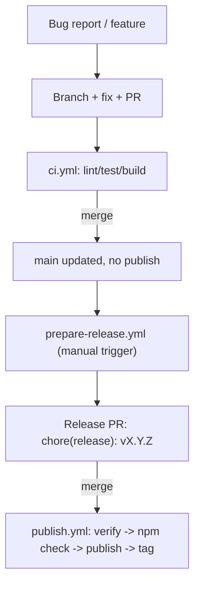

# Releasing `@nuxtlib/consent`

This document describes how code changes get from a bug report / feature branch
all the way to a published npm release. It reflects the CI/CD design implemented
in `.github/workflows/`.

## Summary

- **`main` is always releasable.** There is no long-lived `staging` branch — this
  is a trunk-based workflow, protected by required CI checks and PR review on `main`.
- **Publishing is CI-only.** Nobody runs `npm publish` locally anymore. npm
  publishing uses [npm Trusted Publishing](https://docs.npmjs.com/trusted-publishers)
  (OIDC), triggered only by a push to `main`.
- **Version bumps happen via PR, not by hand.** A manually-triggered workflow
  opens a "release PR" that bumps the version and updates the changelog. Merging
  it is what actually ships a release.
- **Git tags are a record, not a trigger.** A `vX.Y.Z` tag is created only *after*
  `npm publish` succeeds, as a permanent pointer to what shipped — nothing listens
  for tag pushes.

## The workflow files

| File | Trigger | Purpose |
|---|---|---|
| [`.github/workflows/verify.yml`](.github/workflows/verify.yml) | `workflow_call` (reused by the two below) | Runs `lint`, `test`, and a **real** (non-stub) `build` job. Shared so CI and publish never drift apart. |
| [`.github/workflows/ci.yml`](.github/workflows/ci.yml) | `pull_request` → `main` | Runs `verify` on every PR. Required status check for branch protection. |
| [`.github/workflows/prepare-release.yml`](.github/workflows/prepare-release.yml) | Manual (`workflow_dispatch`) | Bumps version + changelog (`changelogen --release --no-tag`), pushes a `release-prep` branch, opens/updates a PR into `main`. |
| [`.github/workflows/publish.yml`](.github/workflows/publish.yml) | `push` → `main` | Re-runs `verify`, checks the npm registry directly for whether the current `package.json` version is already published, and if not: builds, `npm publish`s (OIDC), then tags the commit. |

## Step-by-step: fixing a bug and shipping it

1. **Branch from `main`** for your fix (e.g. `fix/i18n-lang-ext`).
2. **Open a PR into `main`.** `ci.yml` runs lint/test/build (via `verify.yml`).
   Branch protection requires these checks (and, ideally, a review) before merging.
3. **Merge the PR.** `main` now contains the fix. Nothing is published yet — the
   version in `package.json` hasn't changed, so a publish would be a no-op anyway.
4. **When you're ready to cut a release**, manually trigger `prepare-release.yml`
   (Actions tab → *Prepare Release* → *Run workflow*). It computes the next semver
   version from conventional commits, updates `CHANGELOG.md`, and opens a PR like
   `chore(release): vX.Y.Z`.
5. **Review and merge that release PR** like any other PR (it goes through `ci.yml` too).
6. **Merging it triggers `publish.yml`.** It verifies again, sees the version isn't
   on npm yet, builds, publishes, and pushes the `vX.Y.Z` tag.

## Why an npm-registry check instead of tag-gating

Earlier iterations considered triggering `publish.yml` off a pushed `vX.Y.Z` tag.
That was dropped because a tag can exist even if the `npm publish` step itself
failed partway through (network blip, npm outage, etc.), permanently "using up"
that version with nothing published. Checking `npm view <name>@<version>`
directly makes the publish job idempotent and self-healing: a failed run can
just be re-triggered (e.g. via a re-run or another push) and it'll try again,
and ordinary merges to `main` that aren't releases are always a safe no-op.

## Local scripts

- `npm run dev:prepare`, `npm run test`, `npm run lint`, `npm run prepack` are
  still used locally and by CI.
- There is **no `release` script anymore** — release preparation and publishing
  both happen exclusively through the GitHub Actions workflows above.

## One-time / occasional setup notes

- Branch protection on `main` should require the `verify / lint`, `verify / test`,
  and `verify / build` status checks (the job names come from `verify.yml`,
  consistent across `ci.yml` and `publish.yml`).
- npm Trusted Publishing must be configured on the npm package settings page to
  trust this repo + the `publish.yml` workflow file, with `id-token: write`
  permission granted in that job (already set).
