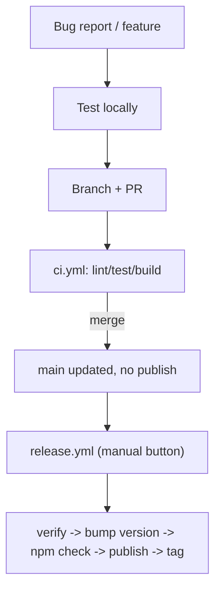

# Releasing `@nuxtlib/consent`

This document describes how code changes get from a bug report / feature branch
all the way to a published npm release. It reflects the CI/CD design implemented
in `.github/workflows/`.

## Summary

- **`main` is always releasable.** There is no long-lived `staging` branch — this
  is a trunk-based workflow, protected by required CI checks and PR review on `main`.
- **Merging to `main` never auto-publishes.** It's due diligence only: `ci.yml`
  gates the PR, and merging just updates `main`. Nothing else happens automatically.
- **Publishing is a single manual button.** `release.yml` (`workflow_dispatch`) is
  triggered on purpose by a maintainer. It bumps the version, builds, and publishes
  to npm via [Trusted Publishing](https://docs.npmjs.com/trusted-publishers) (OIDC)
  — all in one run, so a failure is unambiguous: if it fails after `verify` passes,
  the failure is about publishing itself, not about the code.
- **Git tags are a record, not a trigger.** A `vX.Y.Z` tag is created only *after*
  `npm publish` succeeds, as a permanent pointer to what shipped — nothing listens
  for tag pushes.

## The workflow files

| File | Trigger | Purpose |
|---|---|---|
| [`.github/workflows/verify.yml`](.github/workflows/verify.yml) | `workflow_call` (reused by the two below) | Runs `lint`, `test`, and a **real** (non-stub) `build` job. Shared so PRs and releases never drift apart. |
| [`.github/workflows/ci.yml`](.github/workflows/ci.yml) | `pull_request` → `main` | Runs `verify` on every PR. Required status check for branch protection. |
| [`.github/workflows/release.yml`](.github/workflows/release.yml) | Manual (`workflow_dispatch`) | Runs `verify` against `main`, then bumps version + changelog (`changelogen --release --no-tag`), pushes that commit straight to `main`, checks the npm registry for idempotency, builds, `npm publish`s (OIDC), and tags the release commit. |

## Step-by-step: fixing a bug and shipping it

1. **Branch from `main`** for your fix (e.g. `fix/i18n-lang-ext`).
2. **Test locally first**: `npm run lint`, `npm run test`, `npm run prepack` — catch
   what you can before ever pushing.
3. **Open a PR into `main`.** `ci.yml` runs lint/test/build (via `verify.yml`).
   Branch protection requires these checks (and, ideally, a review) before merging.
4. **Merge the PR.** `main` now contains the fix. This is due diligence only —
   nothing publishes automatically.
5. **When you're ready to cut a release**, manually trigger `release.yml`
   (Actions tab → *Release* → *Run workflow*). In one run it:
   - re-verifies `main` (lint/test/build),
   - computes the next semver version from conventional commits and updates
     `CHANGELOG.md` (`changelogen`), pushing that commit straight to `main`,
   - checks the npm registry to confirm this version isn't already published,
   - builds and `npm publish`s via OIDC,
   - pushes a `vX.Y.Z` tag once publish succeeds.

## Why a manual button instead of auto-publish on merge

An earlier version of this workflow auto-triggered a publish attempt on every
push to `main`. That caused confusing surprises — an unrelated merge (e.g. a CI
fix) could kick off a publish attempt for an already-in-flight release. Making
`release.yml` `workflow_dispatch`-only means publishing only ever happens when
a maintainer deliberately clicks the button, and a merge to `main` is always
"just due diligence," never a hidden trigger.

## Why an npm-registry check instead of tag-gating

Checking `npm view <name>@<version>` directly (rather than relying on git tags
existing) makes `release.yml` idempotent and self-healing: if a previous run's
`npm publish` step failed partway through, simply re-running the workflow picks
up where it left off — it won't re-bump the version, and it won't error if the
version somehow already made it to the registry.

## Local scripts

- `npm run dev:prepare`, `npm run test`, `npm run lint`, `npm run prepack` are
  still used locally and by CI — run these before pushing to catch issues early.
- There is **no `release` script anymore** — version bumping and publishing both
  happen exclusively through `release.yml`.

## One-time / occasional setup notes

- Branch protection on `main` should require the `verify / lint`, `verify / test`,
  and `verify / build` status checks (the job name `verify` is consistent across
  `ci.yml` and `release.yml`).
- `release.yml` pushes the version-bump commit and the release tag directly to
  `main`, bypassing the PR flow on purpose (it's a deliberate, manually-triggered
  action). If branch protection blocks even this, you'll need to allow this
  workflow/actor to bypass required-PR rules for `main`.
- npm Trusted Publishing must be configured on the npm package settings page
  (Settings → Publishing access → Trusted Publisher) to trust this repo +
  the `release.yml` workflow file, with `id-token: write` permission granted
  in that job (already set).
